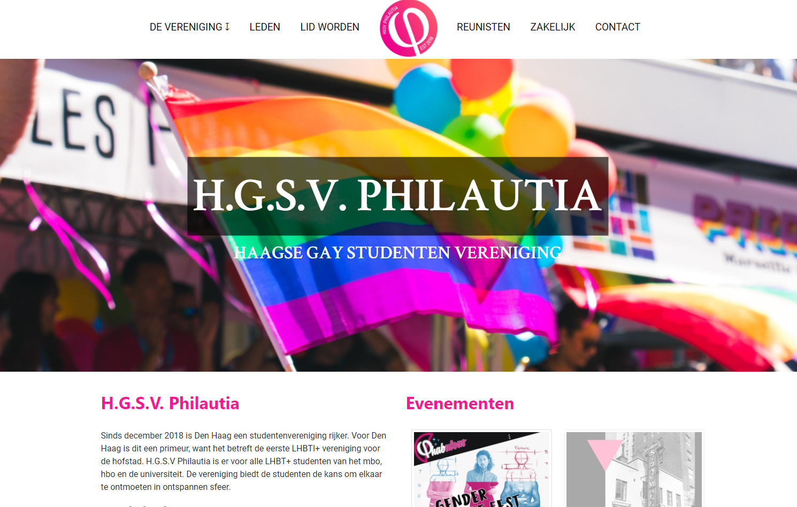

# Short Description:
This repository is for the website of Philautia. Philautia exists since 2019 and is the first and only student association in the Hague (the Netherlands) for LGBT+ students. As soon as I heard of its existance I decided to build a website for them while trying to contact them. I already had a nice proof of concept to show them when I reached out to them. Unfortunately they signed a year contract with the website maker Squarespace. Thus there was no need for my website.

I have designed and build the website from scratch by myself.

**Current live link**
https://https://philautia.netlify.app/

# Getting Started as a developer:
git clone or pull the project. No frameworks except for Bootstrap had been used. 
```sh 
git clone
```

# Screenshots:


